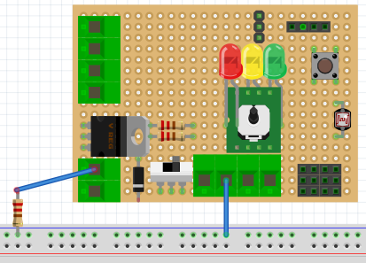

# Montaje 11: zona activa

En esta práctica el transistor va a actuar como amplificador de corriente, dentro de la zona activa para ello se va a realizar el siguiente montaje:

El funcionamiento de este circuito es el siguiente: a partir de potenciómetro que tenemos en la placa EduBásica controlamos la salida PWM del pin D6 variando la tensión aplicada a la resistencia de base Rb que en Edubásica es R6:

Utilizaremos el siguiente código:

Y el resultado es que podemos tener el transistor dentro de la zona activa manejando el potenciómetro, en el siguiente vídeo se muestra el polímetro que mide la tensión del colector y como varía de **corte** (casi 5V) a **saturación** (casi 0V) pasando por la zona **activa**: 

https//www.youtube.com/watch?v=c1kftQtfyfg?rel=0
