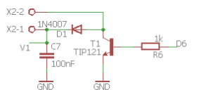

# Montaje 14: Pitido

## Con EDUBÁSICA

Al ser una bobina, es conveniente utilizar una amplificación por medio de un transistor, utilizaremos EDUBASICA y conectaremos el altavoz en el tereminal X2 y el interruptor V1 en ON para que esté alimentado



El código es muy sencillo, simplemente es una intermitencia por** D6** que en este caso se ha elegido **1ms** ¿que pasaría si aumentamos este valor?

```cpp
void setup() {
  // put your setup code here, to run once:
  pinMode(6, OUTPUT); 
}

void loop() {
  // put your main code here, to run repeatedly:
   digitalWrite(6, HIGH);   // Encendemos el pin6
   delay(1);              // esperamos 1 msegundo
   digitalWrite(6, LOW);    // Apagamos el pin6  
   delay(1);        // esperamos 1 msegundo
}
```

El resultado es :

https//www.youtube.com/watch?v=7SsKMj2WMSw?rel=0

## Sin EDUBÁSICA

Bueno, vamos a conectarlo DIRECTAMENTE a D6 (el otro extremo a GND) no es muy conveniente pero a ver el resultado (con el mismo código):

https//www.youtube.com/watch?v=wcJBEfr8hNo?rel=0
## Premio de un jamón de Teruel quien conteste bien a esta pregunta:

¿Cuál suena más?


