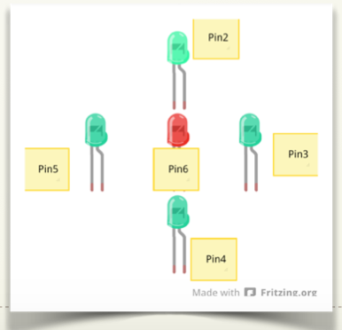

# Montaje 1bis Encender LEDs sin EDUBASICA

Vamos a ver un ejemplo implementando un **mosaico de LEDs**:

Las conexiones serán las siguientes:

El objetivo es que según la tecla que presionemos en la aplicación “Blue Control”, se encenderá el led correspondiente: (arriba, abajo, izquierda, derecha y centro). Además si pulsamos alguno de los botones laterales, los leds deberán realizar una animación de todos los leds:

-    Encendido de los leds en sentido horario.
-    Encendido de los leds en sentido antihorario.
-    Encendido intermitente de los leds exteriores y el interior.
-    Encendido intermitente de todos los leds.

INVENTA MÁS ANIMACIONES PARA INCLUIRLAS EN LOS BOTONES QUE SOBRAN EN LA APLICACIÓN

Para simplificar el código, hemos creado funciones para ejecutar cada una de las animaciones, estas funciones están al final del programa.

La lectura se hace mediante 2 funciones:

- La función **Serial.available()** nos indica si hay un dato disponible en el puerto serie (verdadero/falso)
- Con la función **dato = Serial.read();** guardamos el dato en una variable (de typo byte)

Con esto tendremos el código ASCII del  caracter enviado por el maestro, por ejemplo si hemos enviado una A tendremos el 65, B = 66, a = 97, b = 98, ... (ascii.cl/es/)

Lo único que nos queda es comparar el dato recibido y elegir la acción que tiene que hacer Arduino.

### Programa

