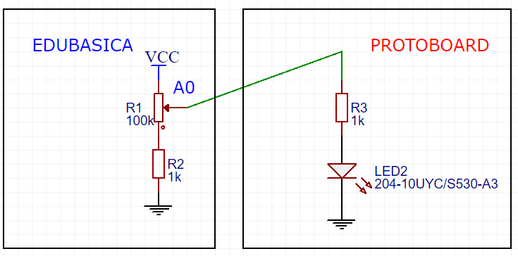
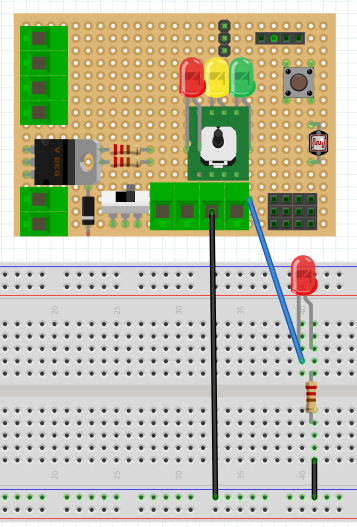
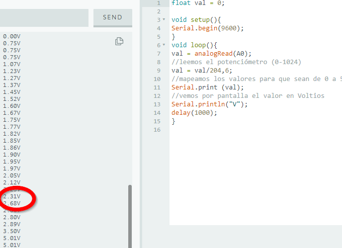
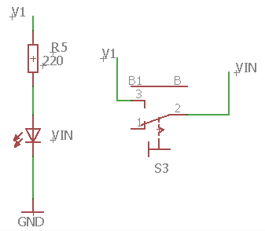

# Montaje 7 Estudio de la tensión umbral de un LED

Vamos a realizar el siguiente esquema:

Para conectar un cable con A0 tenemos que localizar el orificio (señalado en esta imagen) y para la masa utilizamos el segundo tornillo

Montamos:

Carga este código en tu placa Arduino:

Abre el Monitor serial de Arduino (ctrl+may+M) y verás el voltaje que está ofreciendo Arduino al montaje que has hecho.

Mueve el potenciómetro y verás que el valor va cambiando. Intenta averiguar cual es la tensión umbral a partir de la cual tu led empieza a emitir luz.

Nota: inicialmente la corriente puede ser muy baja por lo que debes fijarte bien cuando empieza a iluminarse.

Verás que alrededor **de 2.5V** el led empieza a iluminarse

**TRUCO**

Se puede hacer **sin ningún circuito exterior**, utilizando la resistencia R5 y **el diodo de VIN**, para ello bastaría:

- Desconectar el interruptor que une V1 con Vin
- Unir con un cable V1 con A0

Poner interruptor en OFF y unir el cable uniendo V1 con A0 (dibujado en morado) :

