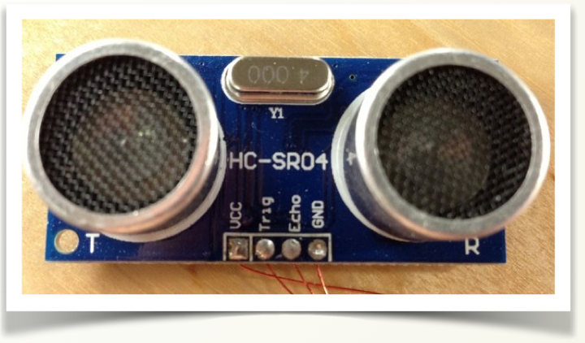

# Montaje 7: Medición de la distancia

Este tipo de sensores también nos permite conocer la distancia a un objeto. Es más preciso que el de infrarrojos visto en la sección anterior y su rango de funcionamiento también es mayor. Funciona desde los 2cm hasta los 3 metros. 

El sensor tiene 2 partes como puedes ver en la figura. Una se encarga de enviar un sonido (a una frecuencia alta que no podemos escuchar), y la otra parte detecta cuando ese sonido vuelve.

Este sensor es muy útil en robots móviles para diversas acciones como no chocar o mantenerse a cierta distancia de una pared.

Podemos usar un sensor de ultrasonidos para obtener la distancia a un objeto. Este sensor se basa en el envío de una señal acústica y la recepción del eco de dicha señal. Lo que haremos después, al igual que hace un radar , un aparato de ecografías o un murciélago es calcular la distancia en función del tiempo que ha tardado el rebotar el sonido y la velocidad del sonido. Podemos encontrar las especificaciones en la página del fabricante. Uno de los modelos más comunes es el HC-SR04:

El sensor que usamos en estos ejemplos tiene 4 pines que corresponden (de izquierda a derecha):

- GND , Vcc (a +5V)
- Trig: es el que emite el ultrasonido
- Echo: Es el que recibe el rebote

(Algunos modelos solo tienen 3 pines -HCSR05- indicándonos por el tercer pin ya directamente un valor proporcional con la distancia.) No aconsejamos usar la Shield de Edubasica, sino conectar diréctamente:

El programa es:

El resultado :

https//www.youtube.com/watch?v=cYiOaTwq2E8?rel=0

