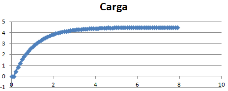

# Montaje 8: Carga de un condensador

**OJO**: LA PATA (-) DEL CONDENSADOR TIENE QUE IR A GND (peligro de explosión si el condensador es electrolítico y si es muy grande)

El cable amarillo inicialmente lo conectamos a GND y luego procederemos a cargar el condensador soltandolo de GND y conectándolo a 5V

El cable rojo mide la tensión del condensador y lo mapearemos por D5 del Arduino.

Y ejecutamos el siguiente código:

Por el monitor serie se van visualizando los valores, ver el vídeo:

https//www.youtube.com/watch?v=b3ERgTsZ3bo?rel=0
La ventaja de utilizar el Arduino, y no el polímetro, es que podemos copiar los valores y pegarlos en una hoja de cálculo, y así visualizar la curva de carga del condensador:

En este caso, se ha utilizado una resistencia de 100k y un condensador de 10uF por lo tanto el tiempo de carga es T= 5RC = 5 seg que es lo que aproximadamente refleja la gráfica. En tu kit de robótica para hacer este curso tienes unos valores parecidos.

